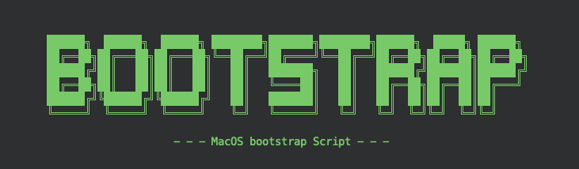

# MacOS Bootstrap


Script to bootstrap new MacOS machines

## Getting Started

To use the script as it currently is you dont need to clone this repo! executing one of the commands below will run the script.

### Prompt for package install
Recommended if you **don't** want to install everything listed in **components.sh**

```
bash <(curl -s https://raw.github.com/markohara/macos-bootstrap/master/setup.sh)
```

### Automatically package install
Recommended if you want to install everything listed in **components.sh** *(temporary solution)*

```
git clone git@github.com:markohara/macos-bootstrap.git; cd $PWD/macos-bootstrap; ./install.sh -y; rm -rf macos-bootstrap
```

⚠️ **WARNING** ⚠️

If for any reason this script stops working or is canceled, ensure you run the **cleanup.sh** script manually. This will ensure all your sensitive information is destoryed. If you haven't cloned the repo the following command will do this;

```
bash <(curl -s https://raw.github.com/markohara/macos-bootstrap/master/cleanup.sh)
```

## Making it your own
If you want to make use of this script fork the [repo](https://github.com/markohara/macos-bootstrap). To add your own list of applications it should only require you to modify the **components.sh** file. The components.sh file holds the details of all the software and packages which the script will install.

Configs are small additional tweaks which will perform additional set up for packages/software and make small changes to MacOS itself, These are things which you may or may not want. The **run.sh** script within the configs directory is where you can enable and disable which tweaks will be run with this script.

Make sure to also change the repo which you are cloning in the **setup.sh** script if you want curl to continue working. Update the readme to also reflect this change.

